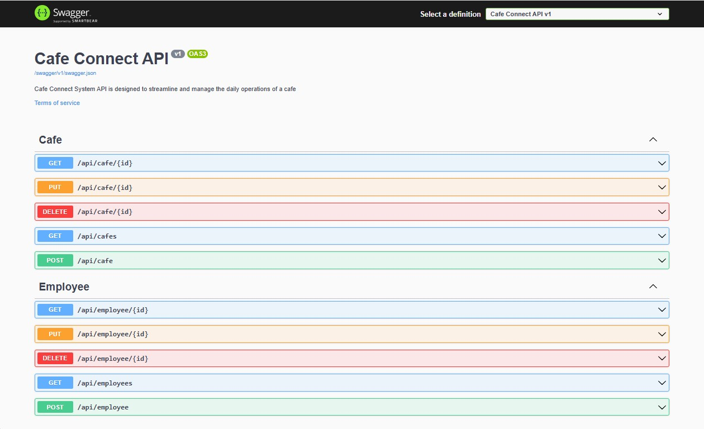
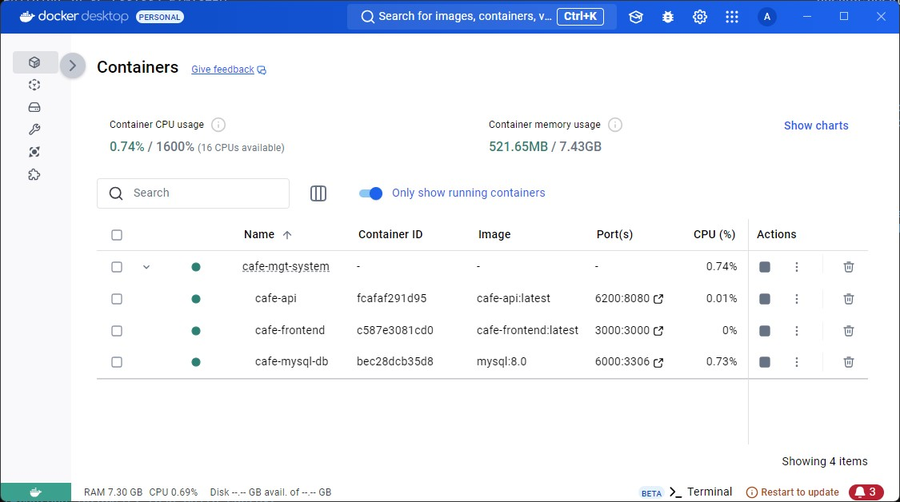
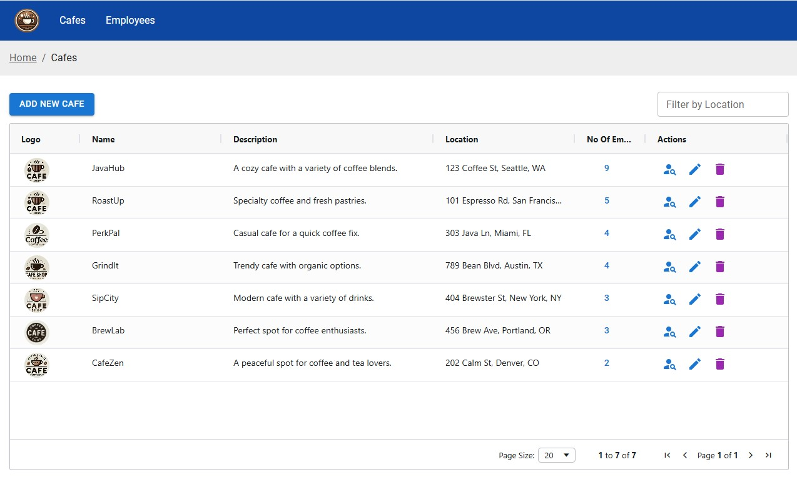
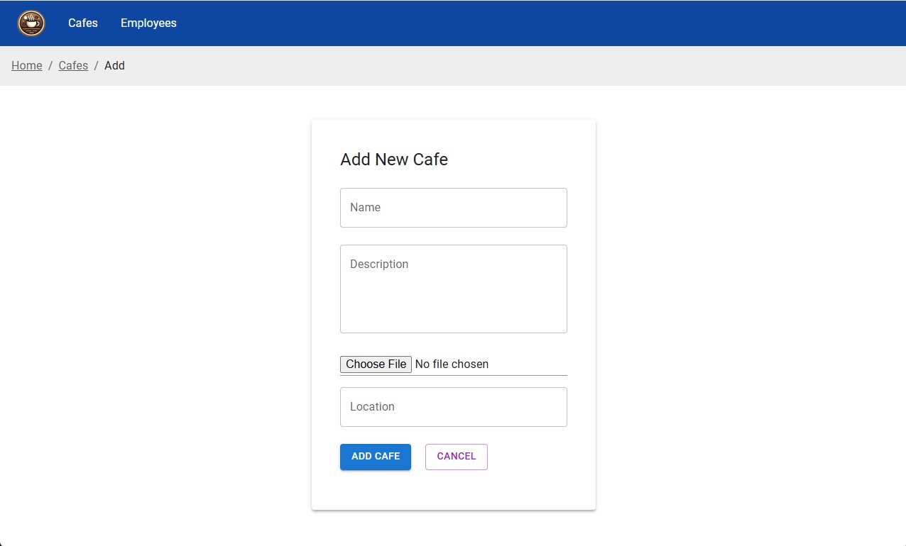
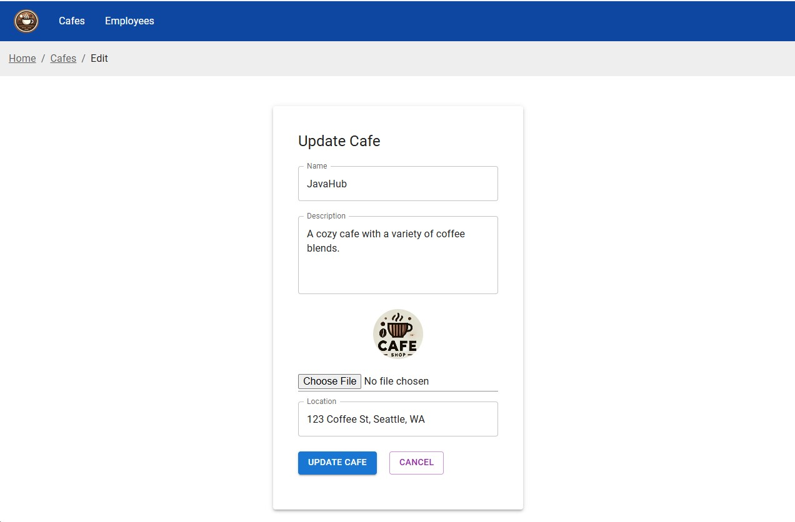
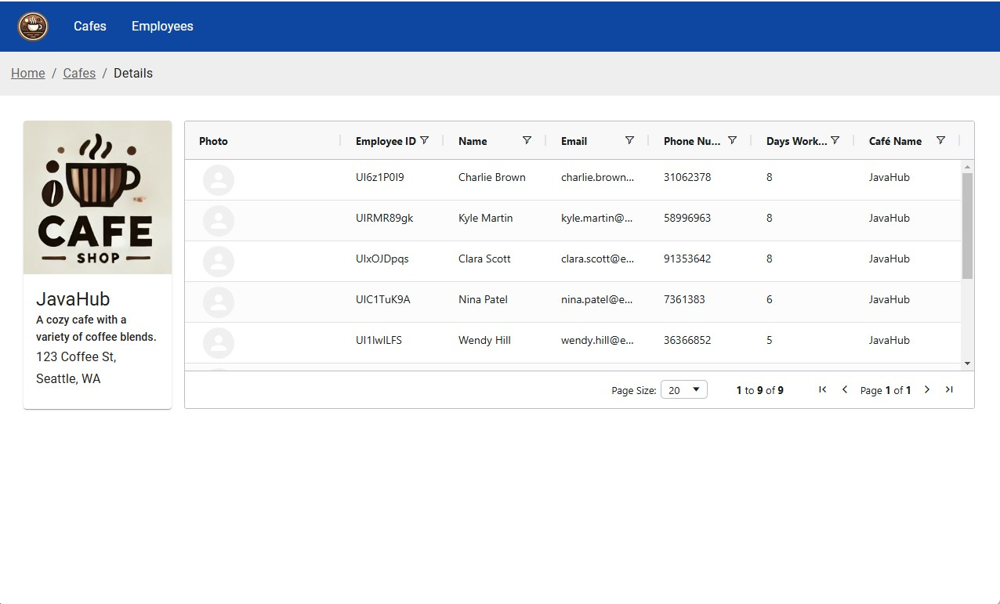
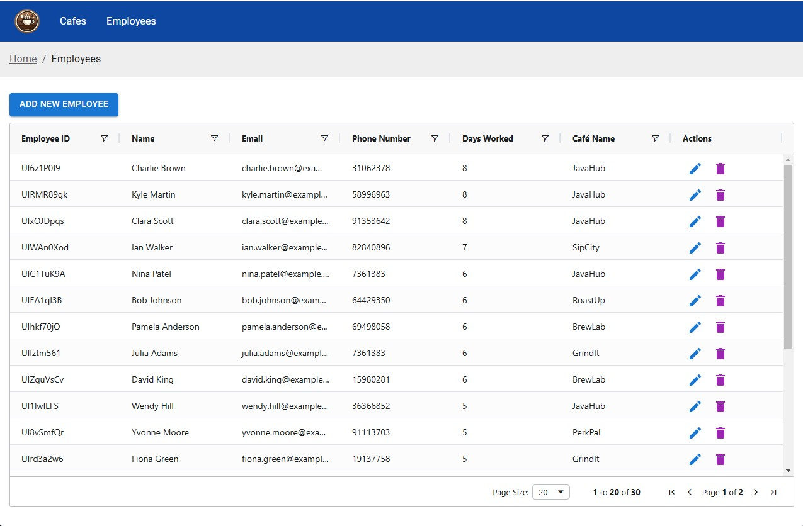

# Cafe Connect Application

## Overview

The **Cafe Connect** application is a modern, full-stack platform designed to manage cafe operations, including employee management, and more. It consists of a backend API built
with **.NET Core 8** and a frontend user interface developed using **React JS**. The application allows cafe managers to interact with the system seamlessly track cafe-related
operations.

## Technologies Used

- **Backend**:

  - .NET Core 8
  - Entity Framework Core 8
  - MySql Database
  - Docker for containerization

- **Frontend**:
  - React JS
  - React Router for routing
  - Axios for API calls
  - TanStack Query (queries & mutations)
  - React Data Grid (ag-grid-react)
  - Material UI

## Features

- **Cafe Management**: Manage cafes, including creation, updating, and deletion.
- **Employee Management**: Manage cafe employees.

## Getting Started

### Prerequisites

- **.NET Core 8 SDK**
- **Node.js** and **npm** (for React app)
- **Docker** (optional, for containerization)
- **MySql Database** (optional, if not using Docker for database)

## Docker Setup (minimum configurations)

1. Clone the repository:

   ```
   git clone https://github.com/arunap/CafeConnect.git
   cd CafeConnect
   ```

2. Build and start the Docker containers:
   ```
   docker-compose up --build
   ```

## Local Setup (Option 2)

### Backend Setup

1. Clone the repository:
   ```
   git clone https://github.com/arunap/CafeConnect.git
   cd CafeConnect
   ```
2. Navigate to the backend folder and restore NuGet packages:
   ```
   cd backend/CafeConnect.Api
   dotnet restore
   ```
3. Update the appsettings.json file with your PostgreSQL connection string, if necessary.
4. Build and run the backend API:
   ```
   dotnet build
   dotnet run
   ```
5. The backend API will be available at http://localhost:6200/api.

### Frontend Setup

1. Navigate to the frontend directory:
   ```
   cd backend/CafeConnect.Api
   ```
2. Install required npm dependencies:
   ```
   npm install
   ```
3. Start the development server:
   ```
   npm start
   ```
4. The React frontend will be available at http://localhost:3000.

## Appendix








